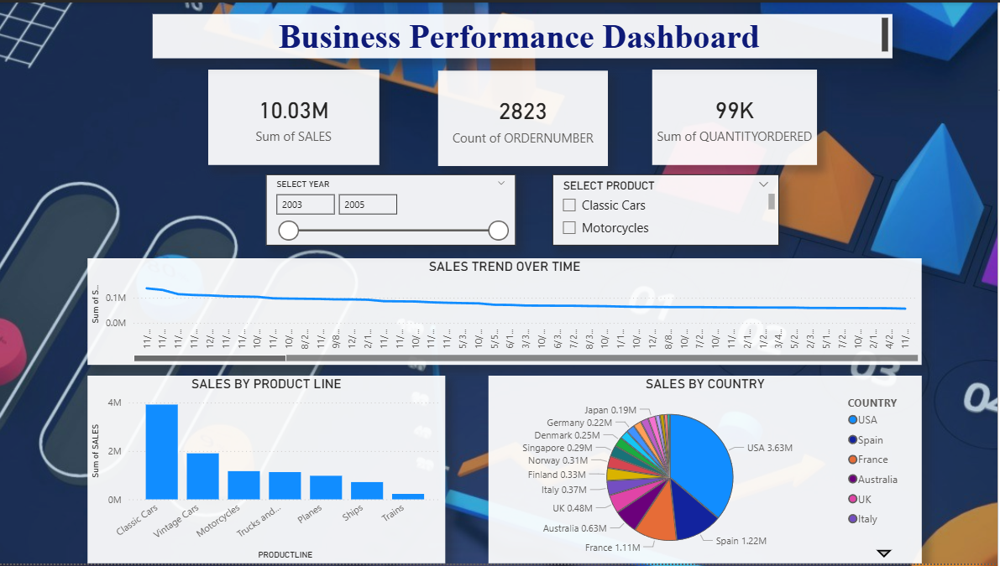

# Customer Segmentation Analysis

## 📊 Project Overview
This project focuses on analyzing customer sales data to identify high-value customers and understand business performance.

## 🛠 Tools & Technologies
- Python (Pandas, Matplotlib)
- Power BI
- Excel

## 📈 Key Features
- Data cleaning and preprocessing using Python
- Customer revenue analysis
- Interactive Power BI dashboard with slicers
- KPI metrics and visualizations

## 📷 Dashboard Preview

## 📌 Insights
- Identified top-performing product lines
- Analyzed sales trends over time
- Compared revenue across different countries

## 🚀 Conclusion
This project demonstrates how data analysis and visualization can support business decision-making.
